# ToS Risk Analyzer - Technical Documentation

<p align="center">
[](https://fastapi.tiangolo.com)
[](https://spacy.io)
[]()
[](https://github.com/pgvector/pgvector)
[](https://neon.tech)
[](https://docker.com)
[](https://railway.app)
</p>

---

## Table of Contents

1. [Executive Summary](#executive-summary)
2. [System Architecture](#system-architecture)
3. [Backend Deep Dive](#backend-deep-dive)
   - [Core Framework](#core-framework-fastapi)
   - [Database Layer](#database-layer)
   - [Authentication System](#authentication-system)
   - [Text Extraction Pipeline](#text-extraction-pipeline)
   - [NLP Pre-processing](#nlp-pre-processing)
   - [LLM Integration](#llm-integration)
   - [Analysis Pipeline](#analysis-pipeline)
   - [Document Chatbot](#document-chatbot)
4. [Workflow Diagrams](#workflow-diagrams)
5. [Frontend Overview](#frontend-overview)
6. [Why This Architecture Works](#why-this-architecture-works)

---

## Executive Summary

**ToS Risk Analyzer** is an AI-powered legal document analysis platform that extracts, classifies, and explains risks in Terms of Service and Privacy Policy documents.

### Key Capabilities

- **Multi-format extraction** — URL, raw text, PDF upload
- **NLP pre-filtering** — spaCy-based risk signal detection before LLM calls
- **LLM risk classification** — Cerebras + Groq round-robin (Llama 3.1 8B) with Ollama local fallback
- **5 risk categories** — Privacy, Legal, User Rights, Security, Financial
- **Batched + parallel processing** — 5-10 clauses/batch, 3 concurrent workers
- **Async analysis** — Instant extraction, LLM runs in background
- **RAG-powered chat** — Gemini embedding + pgvector semantic search with clause citations
- **Document comparison** — Side-by-side RAG-retrieval across two policies
- **Production-deployed** — Railway (Docker) with PostgreSQL + pgvector

---

## System Architecture

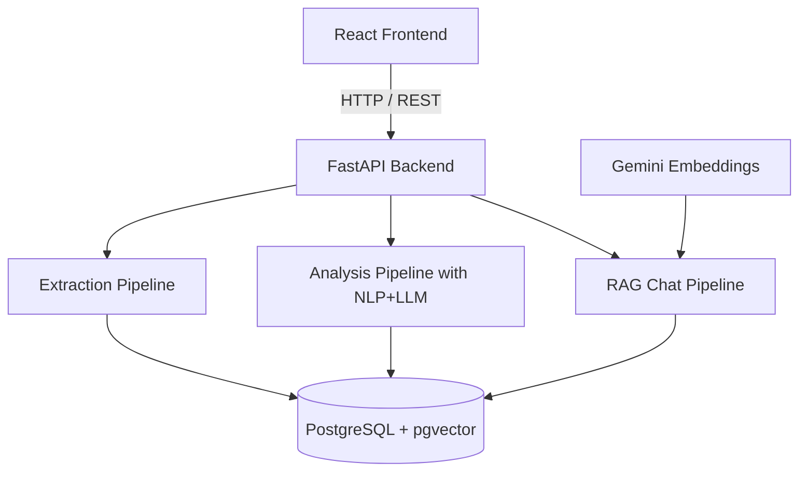

---

## Backend Deep Dive

### Core Framework: FastAPI

**FastAPI** is a modern Python web framework built on top of Starlette for routing and Pydantic for data validation.

#### Why FastAPI?

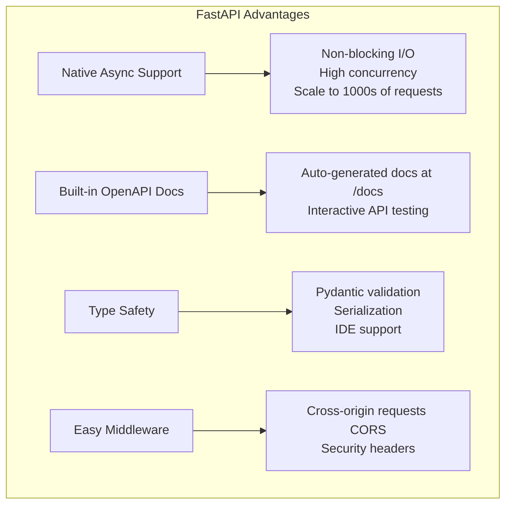

#### Async Analysis Pattern

The most important architectural decision is handling **long-running LLM operations**:

```python
# Backend immediately returns, LLM runs in background
@app.post("/analyze/async")
async def analyze_async(
    body: AnalyzeInput,
    background_tasks: BackgroundTasks,
    db: AsyncSession = Depends(get_db),
    current_user: User | None = Depends(get_optional_user),
):
    # 1. Extract text (fast)
    extraction = handle_input(body.input_type, body.content)
    
    # 2. Create job in database
    job_id = str(uuid.uuid4())
    await crud.create_analysis_job(db, job_id, ...)
    
    # 3. Schedule background task
    background_tasks.add_task(_run_analysis_background, job_id, extraction)
    
    # 4. Return immediately with job_id
    return {"job_id": job_id, "status": "processing", "extraction": extraction}
```

**Why this matters:**
- HTTP requests won't timeout on long LLM calls
- Users can poll for results via `/analyze/status/{job_id}`
- Server handles many concurrent analysis requests

---

### Database Layer

#### Technology Stack

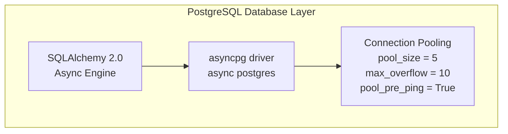

#### Data Models

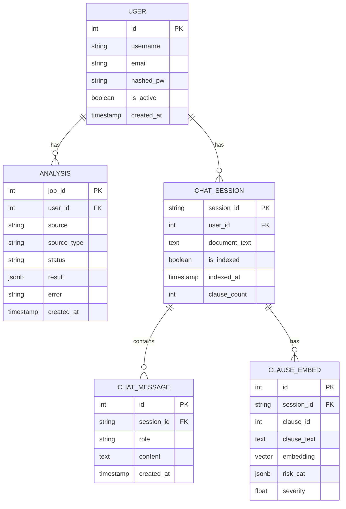

#### Key Design Decisions

| Decision | Rationale |
|----------|-----------|
| **Async SQLAlchemy** | Non-blocking DB ops, essential for high-concurrency FastAPI |
| **JSONB for results** | Store complex analysis without separate tables |
| **Nullable user_id** | Supports both authenticated and anonymous users |
| **Cascade deletes** | Automatic cleanup of related records |
| **Job status enum** | Enables polling workflow (`processing` → `complete`/`failed`) |

---

### Authentication System

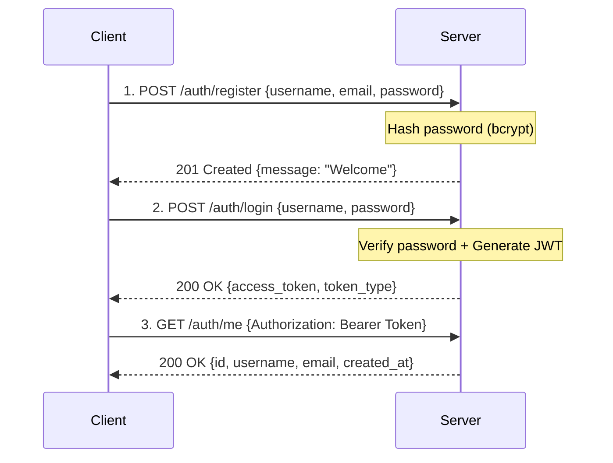

#### JWT + bcrypt Implementation

```python
# Password Hashing (with SHA256 pre-hash to bypass 72-char bcrypt limit)
def hash_password(plain: str) -> str:
    pre_hashed = hashlib.sha256(plain.encode("utf-8")).hexdigest()
    salt = bcrypt.gensalt()
    hashed = bcrypt.hashpw(pre_hashed.encode("utf-8"), salt)
    return hashed.decode("utf-8")

# JWT Token Creation
def create_access_token(user_id: str, email: str) -> str:
    expire = datetime.now(timezone.utc) + timedelta(minutes=60)
    payload = {"sub": user_id, "email": email, "exp": expire}
    return jwt.encode(payload, SECRET_KEY, algorithm=ALGORITHM)
```

#### Dual Auth Dependency Pattern

```python
# Requires authentication - returns 401 if not logged in
async def get_current_user(token: str = Depends(oauth2_scheme)):
    ...

# Optional authentication - returns None if not logged in
async def get_optional_user(token: str | None = Depends(oauth2_scheme)):
    ...
```

**Why both?** Allows anonymous analysis while supporting user-specific history.

---

### Text Extraction Pipeline

```mermaid
graph TD
    subgraph Input Types
        URL[URL String]
        PDF[PDF File]
        TEXT[Raw Text]
    end
    
    URL --> ExtURL[url_extractor.py]
    PDF --> ExtPDF[pdf_extractor.py]
    TEXT --> ExtTXT[direct pass-through]
    
    ExtURL --> Cleaner[text_cleaner.py<br/>Normalize whitespace<br/>Split paragraphs<br/>Compute stats]
    ExtPDF --> Cleaner
    ExtTXT --> Cleaner
    
    Cleaner --> Output[{Output Structure<br/>source_type, source, raw_text<br/>cleaned_text, paragraphs<br/>char_count, line_count}]
```

#### URL Extraction (`url_extractor.py`)

**Workflow:**
```
URL → HTTP GET (with Chrome UA) → BeautifulSoup(lxml) → Remove noise → Extract content → Text
```

**Smart Content Detection:**
```python
def find_main_content(soup):
    # 1. Try semantic HTML5 tags
    semantic = soup.find("main") or soup.find("article")
    if semantic and len(semantic.get_text(strip=True)) > 1000:
        return semantic
    
    # 2. Try ID/class pattern matching
    pattern_match = soup.find(id=re.compile(r"content|terms|policy|main|legal"))
    if pattern_match and len(pattern_match.get_text(strip=True)) > 1000:
        return pattern_match
    
    # 3. Fallback: largest div/section
    candidates = soup.find_all(["div", "section", "article"])
    best = max(candidates, key=lambda x: len(x.get_text(strip=True)))
    return best
```

**Why this approach?**
- **User-Agent spoofing** - Bypasses bot detection
- **lxml parser** - Faster and more lenient than html.parser
- **Noise removal** - Removes scripts, nav, footer, ads, cookie popups
- **Multi-strategy detection** - Semantic → Pattern → Heuristic

#### PDF Extraction (`pdf_extractor.py`)

**Why pdfplumber?**
- Pure Python (no system dependencies)
- Better layout handling than PyPDF2
- Simple API with good defaults

```python
with pdfplumber.open(filepath) as pdf:
    for page in pdf.pages:
        text = page.extract_text(x_tolerance=3, y_tolerance=3)
        if text and len(text.strip()) > 10:
            full_text.append(text)
```

---

### NLP Pre-processing

#### The Problem

Legal documents are long paragraphs containing multiple clauses. Each clause needs individual risk assessment.

#### Solution: Two-Stage NLP Pipeline

```mermaid
graph TD
    subgraph Stage 1: Clause Segmentation
        Ext[EXTRACTED TEXT<br/>paragraphs] --> HD[1. Heading Detection<br/>regex patterns]
        HD --> SS[2. Sentence Splitting<br/>spaCy]
        SS --> CM[3. Clause Merging<br/>Min 40 chars, Max 1200 chars]
        CM --> Out1[{Output:<br/>id, text, section_heading}]
    end
    
    Out1 --> Stage2
    
    subgraph Stage 2: Feature Extraction
        Stage2[For each clause] --> MV[MODAL VERBS<br/>may, might, can...]
        Stage2 --> NEG[NEGATION<br/>not, never, waive...]
        
        MV --> RK[RISK KEYWORDS<br/>50+ regex patterns]
        NEG --> RK
        
        RK --> Score[RISK SCORING<br/>Keyword: +1.0<br/>Negation: +0.5<br/>Modal: +0.5<br/>Boilerplate: -1.0]
        
        Score --> Threshold{Threshold >= 2.0}
        Threshold -->|Yes| Send[Send to LLM]
        Threshold -->|No| Skip[Skip LLM]
    end
```

#### Risk Categories & Keywords

| Category | Keywords |
|----------|----------|
| **Privacy Risk** | collect, personal data, third-party, sell, track, cookie, profiling, data retention |
| **Legal Risk** | arbitration, class action, waiver, jurisdiction, indemnify, liability, lawsuit, dispute resolution |
| **User Rights Risk** | terminate, suspend, ban, at our discretion, content ownership, irrevocable, opt-out |
| **Security Risk** | data breach, encryption, unauthorized access, as is, best efforts, not responsible |
| **Financial Risk** | auto-renew, automatically charged, non-refundable, subscription fee, price change, billing |

#### Why This Hybrid Approach?

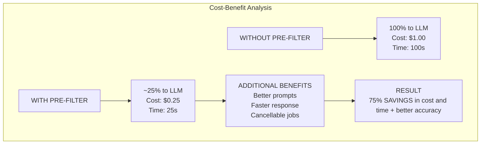

---

### LLM Integration

#### Architecture: Dual Provider System

```mermaid
graph TD
    Input[CLASSIFY.CLAUSE<br/>OR<br/>CLASSIFY.BATCH] --> Check{CHECK: CEREBRAS OR GROQ KEYS<br/>Round-Robin}
    
    Check -->|YES| RR{Round Robin}
    Check -->|NO| Ollama[OLLAMA FALLBACK<br/>Local phi3.5 / qwen3.5:9b<br/>Offline support]
    
    RR --> Cerebras[CEREBRAS API<br/>llama3.1-8b<br/>Fast inference]
    RR --> Groq[GROQ API<br/>llama-3.1-8b-instant<br/>High throughput]
    
    Cerebras --> Parse[RESPONSE PARSING<br/>Strip markdown<br/>Extract JSON<br/>Validate fields]
    Groq --> Parse
    Ollama --> Parse
    
    Parse --> Out[{RETURN RESULT<br/>is_risky, risk_categories<br/>confidence, explanation}]
```

#### Cerebras API

**Why Cerebras?**

| Factor | Benefit |
|--------|---------|
| **Fast inference** | Specialized hardware (Wafer-Scale Engine) |
| **Cost-effective** | Significantly cheaper than OpenAI |
| **JSON mode** | Native structured output, no parsing hacks |
| **Open-source model** | Llama 3.1 is well-documented |

**API Call:**
```python
response = httpx.post(
    "https://api.cerebras.ai/v1/chat/completions",
    headers={"Authorization": f"Bearer {api_key}"},
    json={
        "model": "llama3.1-8b",
        "messages": [{"role": "user", "content": prompt}],
        "response_format": {"type": "json_object"},
        "temperature": 0.1,
        "max_completion_tokens": 200
    }
)
```

#### Ollama Fallback

**Why local fallback?**

- **Zero API cost** after hardware investment
- **Offline capability** - Works when internet/API is down
- **Privacy** - Documents never leave your infrastructure
- **Dev flexibility** - Test without API keys

**Models:**
- `phi3.5` - Lightweight, fast classification
- `qwen3.5:9b` - Better conversational understanding for chat

#### Classification Prompt Engineering

```python
PROMPT_TEMPLATE = """You are a legal risk analyst specializing in Terms of Service.

Analyze the following clause and classify any risks present.

CLAUSE:
{clause_text}

NLP SIGNALS DETECTED:
- Modal verbs found: {modal_verbs}
- Negation present: {has_negation}
- Pre-flagged categories: {triggered_categories}
- Named entity types: {entity_types}

RISK CATEGORY DEFINITIONS:
- Privacy Risk: data collection, sharing, selling, tracking user data
- Legal Risk: mandatory arbitration, class action waiver, jurisdiction
- User Rights Risk: account termination, content ownership transfer
- Security Risk: data breach, no encryption, "as is" disclaimers
- Financial Risk: auto-renewal, non-refundable charges

Respond ONLY with valid JSON:
{{
  "is_risky": true or false,
  "risk_categories": ["Privacy Risk"] or [],
  "confidence": "High" or "Medium" or "Low",
  "explanation": "one sentence in plain English"
}}"""
```

#### Batch Classification

Process 5-10 clauses in a single LLM call for **5-10x speedup**:

```python
BATCH_PROMPT_TEMPLATE = """Analyze EACH of the following clauses...

CLAUSES:
[Clause 0]
{clause_0_text}
NLP SIGNALS: ...

[Clause 1]
{clause_1_text}
NLP SIGNALS: ...

...

Respond with JSON:
{{
  "results": [
    {{"clause_id": 0, "is_risky": ..., ...}},
    {{"clause_id": 1, "is_risky": ..., ...}}
  ]
}}"""
```

---

### Analysis Pipeline

#### End-to-End Flow

```mermaid
graph TD
    Input[USER INPUT<br/>URL / PDF / Text] --> Ext[1. EXTRACTION<br/>handle_input]
    
    Ext --> Seg[2. SEGMENTATION<br/>segment_clauses<br/>~10-50 clauses]
    
    Seg --> NLP[3. NLP FEATURE EXTRACTION<br/>extract_features<br/>is_likely_risky >= 2.0]
    
    NLP -->|~75% skipped| Agg[5. RISK AGGREGATION]
    NLP -->|~25% pass| LLM{4. LLM CLASSIFICATION<br/>Adaptive Batching}
    
    LLM --> Split[SPLIT clauses into batches of 10]
    
    Split --> Worker1[PROCESS in parallel<br/>Worker 1: Batch 0]
    Split --> Worker2[Worker 2: Batch 1]
    Split --> WorkerN[Worker N: Batch N]
    
    Worker1 --> Success[SUCCESS<br/>batch_size += 1]
    Worker2 --> Failure[FAILURE 429/err<br/>batch_size //= 2]
    WorkerN --> Success
    
    Failure --> Fallback[FALLBACK: Per-clause if batches fail]
    Success --> Agg
    Fallback --> Agg
    
    Agg --> Result[{Output:<br/>overall_risk<br/>risk_breakdown<br/>clauses}]
```

#### Cancellation Support

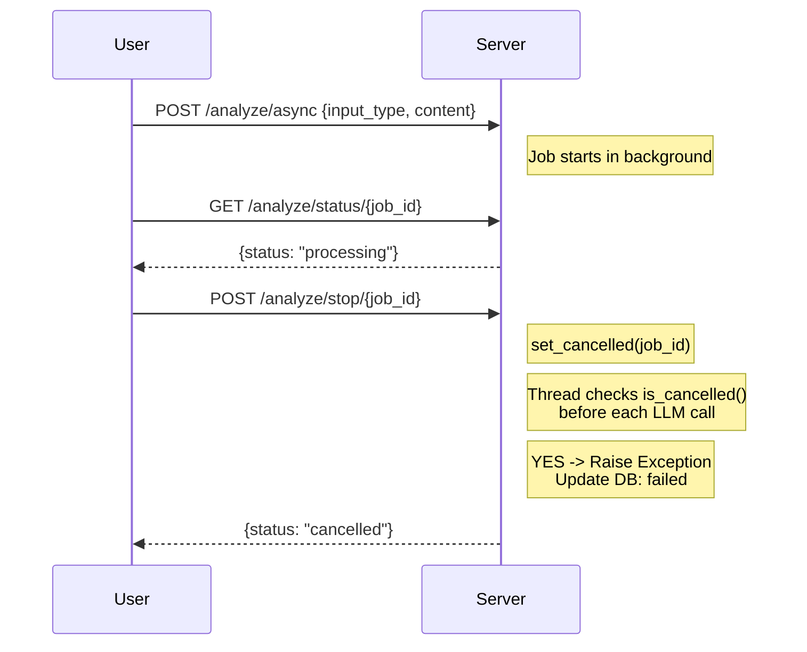

---

### Document Chatbot

#### RAG Architecture (2026)

The chatbot now uses **Retrieval-Augmented Generation (RAG)** with pgvector for semantic search:

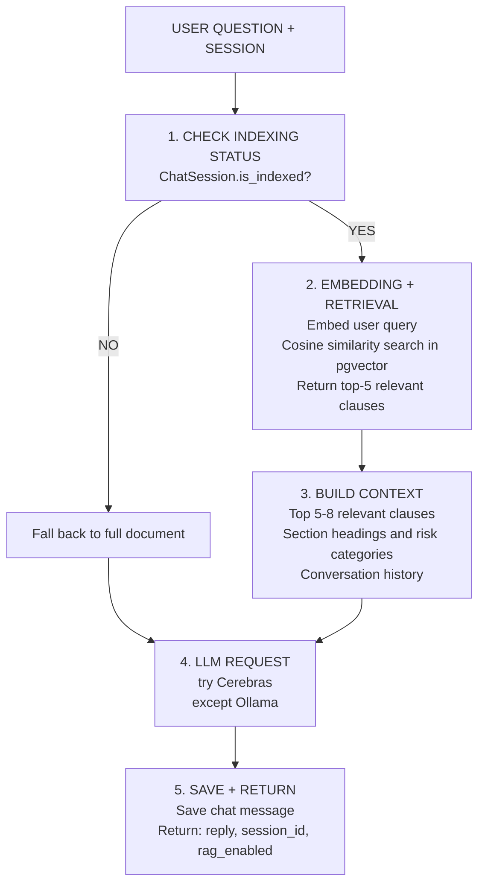

#### Auto-Indexing Flow

When a document is stored for chat, it is automatically indexed in the background:

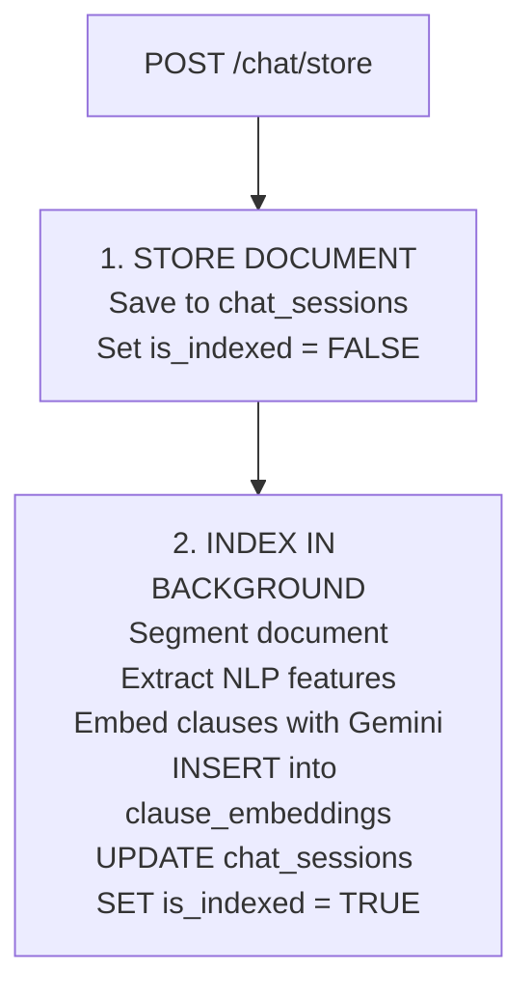

#### Comparison Feature

New in 2026: Compare two documents side-by-side:

```mermaid
graph TD
    Input[POST /chat/compare<br/>session_id_a, session_id_b, question] --> Retrieve[Retrieve top-4 clauses from each doc]
    Retrieve --> Build[Build comparison context]
    Build --> LLM[LLM compares directly]
    LLM --> Out[{Return: reply, doc_a_clauses, doc_b_clauses}]
```

#### Clause Browsing API

Users can browse document clauses directly:

| Endpoint | Description |
|----------|-------------|
| `GET /chat/{id}/clauses` | List all clauses (filter by risk/category) |
| `GET /chat/{id}/clauses/{cid}` | Get specific clause |
| `GET /chat/{id}/risks` | Get risk summary by category |
| `GET /chat/{id}/index/status` | Check indexing progress |

```mermaid
graph TD
    Input[USER QUESTION + SESSION] --> Load[1. LOAD SESSION<br/>crud.get_chat_session]
    Load --> Build[2. BUILD MESSAGES<br/>SYSTEM_PROMPT with document_text truncated<br/>Append conversation history]
    Build --> LLM[3. LLM REQUEST<br/>try Cerebras: llama3.1-8b<br/>except Ollama: qwen3.5:9b]
    LLM --> Save[4. SAVE TO HISTORY<br/>crud.add_chat_message]
    Save --> Out[{RETURN reply, session_id}]
```


---

## Workflow Diagrams

### Complete User Flow

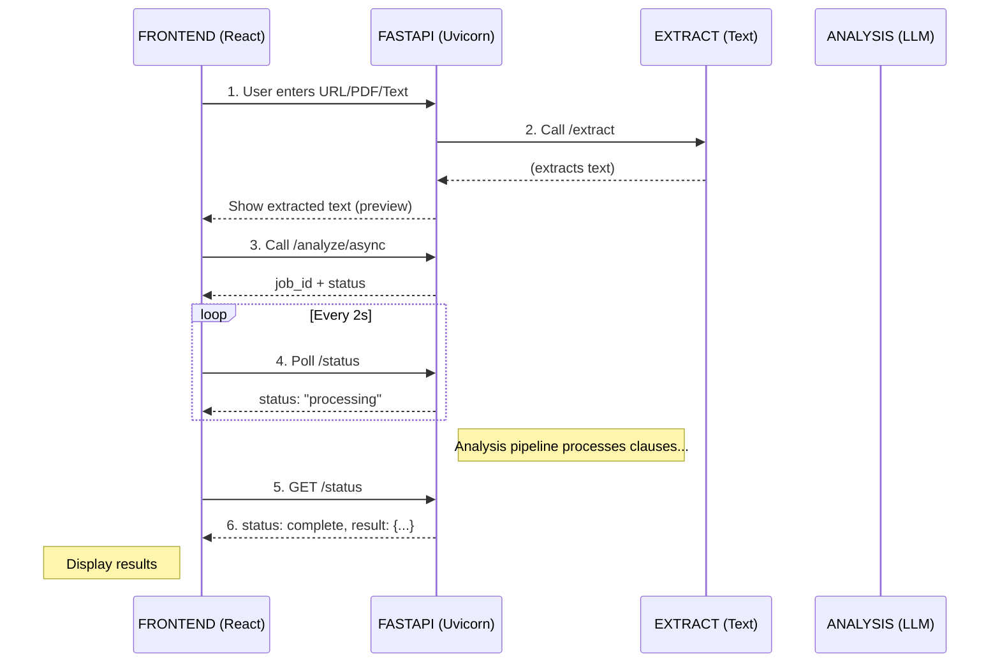

### Authentication Flow

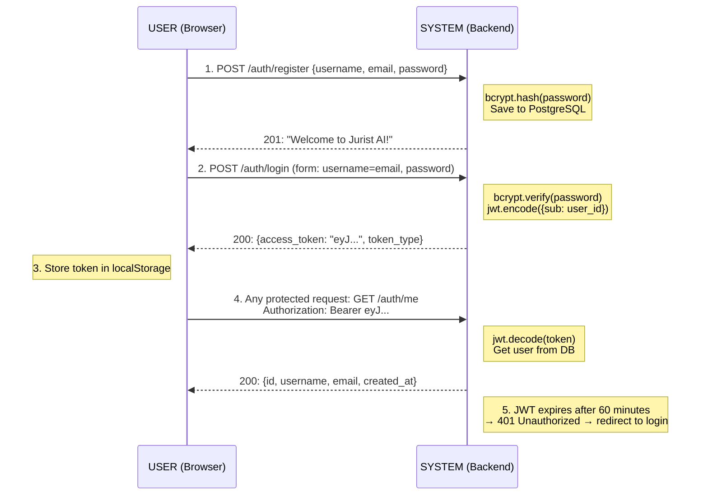

### Analysis Job Flow

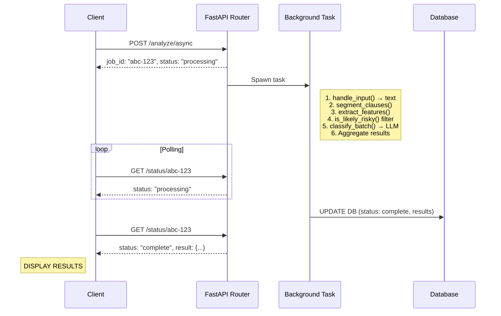

---

## Frontend Overview

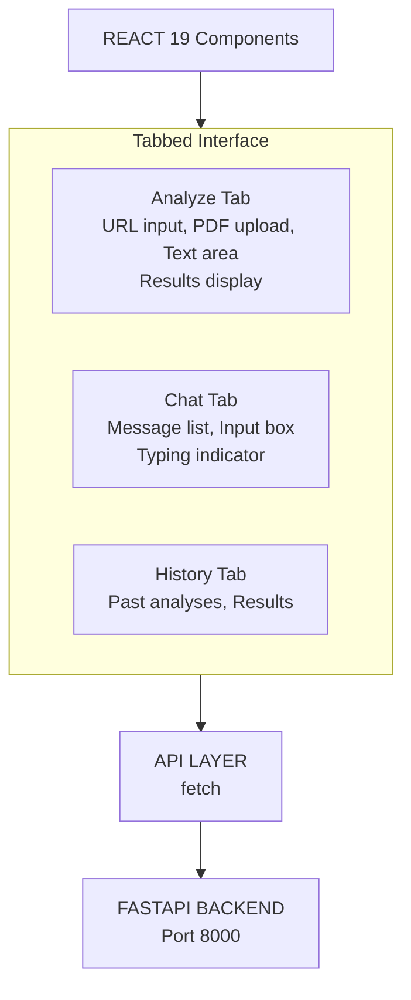

### Technology Stack

| Component | Technology | Version |
|-----------|------------|---------|
| **Framework** | React | 19.x |
| **Build Tool** | Vite | 8.x |
| **Animations** | Framer Motion | 12.x |
| **Icons** | Lucide React | 1.6.x |
| **Markdown** | Marked | 17.x |

### Key Features

- **Tabbed Interface** — Analyze | Chat | History
- **Real-time Feedback** — Loading overlays, skeleton loaders
- **Responsive Design** — Works on mobile and desktop
- **Dark Theme** — Modern, eye-friendly UI
- **Markdown Rendering** — Chat responses rendered as Markdown

---

## Why This Architecture Works

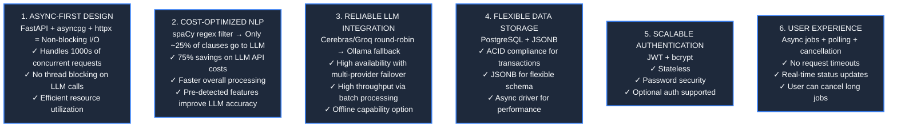

---

## Technology Summary

| Layer | Technology | Why |
|-------|------------|-----|
| **Web Framework** | FastAPI + Uvicorn | High-performance async API |
| **Database** | PostgreSQL + SQLAlchemy async + pgvector | Robust + scalable + vector search |
| **Embeddings** | Google Gemini API (gemini-embedding-001) | State-of-the-art semantic representations |
| **Auth** | JWT + bcrypt | Stateless + secure |
| **NLP** | spaCy (en_core_web_sm) | Sentence segmentation, linguistic features |
| **LLM (Primary)** | Cerebras + Groq APIs (Llama 3.1 8B) | Fast inference, JSON mode, round-robin load balancing |
| **LLM (Fallback)** | Ollama (phi3.5, qwen3.5) | Local, offline capable |
| **URL / PDF Extraction**| BeautifulSoup4 + lxml / pdfplumber | Robust HTML and Pure Python PDF parsing |
| **Frontend** | React 19 + Vite + Framer Motion | Modern, dynamic component-based UI |
| **Deployment** | Railway (Docker) | Managed production environment |

---

<p align="center">
  <strong>Built with FastAPI • spaCy • Cerebras • Groq • pgvector • React • Railway</strong>
</p>
