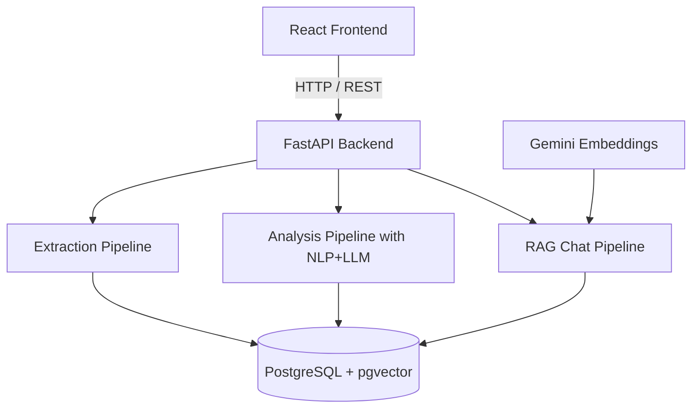
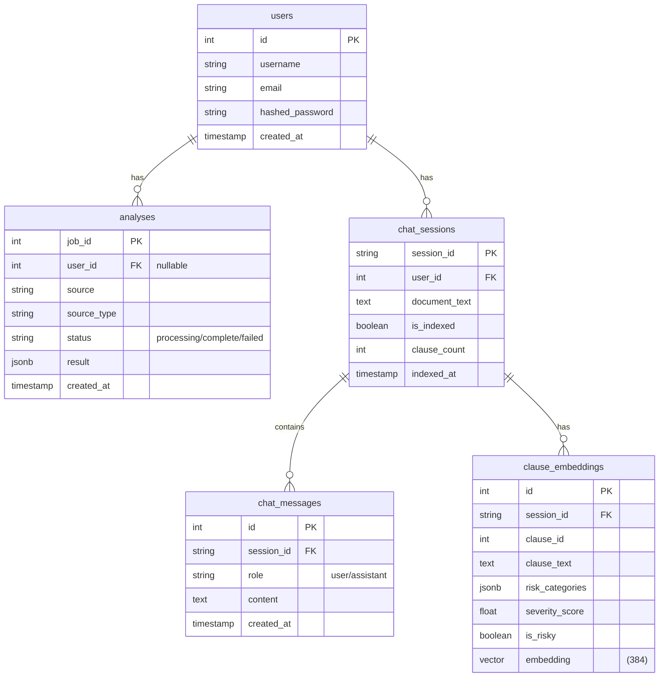

<div align="center">

```
╔══════════════════════════════════════════════════════════════╗
║                                                              ║
║      ██╗██╗   ██╗██████╗ ██╗███████╗████████╗     █████╗ ██╗ ║
║      ██║██║   ██║██╔══██╗██║██╔════╝╚══██╔══╝    ██╔══██╗██║ ║
║      ██║██║   ██║██████╔╝██║███████╗   ██║       ███████║██║ ║
║ ██   ██║██║   ██║██╔══██╗██║╚════██║   ██║       ██╔══██║██║ ║
║ ╚█████╔╝╚██████╔╝██║  ██║██║███████║   ██║       ██║  ██║██║ ║
║  ╚════╝  ╚═════╝ ╚═╝  ╚═╝╚═╝╚══════╝   ╚═╝       ╚═╝  ╚═╝╚═╝ ║
║                                                              ║
║              AI  ·  R I S K  ·  A N A L Y Z E R            ║
║                                                              ║
╚══════════════════════════════════════════════════════════════╝
```

### *You agreed to what, exactly?*

**AI-powered legal intelligence** that dissects Terms of Service and Privacy Policies — extracting, classifying, and explaining risks in plain English so you actually know what you're signing.

<br/>

[](https://fastapi.tiangolo.com)
[](https://spacy.io)
[]()
[](https://github.com/pgvector/pgvector)
[](https://neon.tech)
[](https://docker.com)
[](https://railway.app)

<br/>

**[🚀 Live Demo](https://tos-frontend-production-8e0d.up.railway.app)** · **[📖 Technical Docs](DOCUMENTATION.md)** · **[🐛 Issues](../../issues)**

</div>

---

## ⚡ What This Does

Most people click *"I Agree"* without reading. This tool reads for you — and tells you exactly what you're signing away.

```
Input:  https://discord.com/terms                    (or paste text / upload PDF)
        ↓
Output: 132 clauses analyzed · 43% flagged risky · Overall: HIGH RISK
        ↓
Chat:   "Can Discord terminate my account without warning?"
        → "Yes. Clause #94 [Legal Risk, High] states Discord may suspend or
           terminate access if they 'reasonably believe' you violated terms —
           no prior notice required, no appeal process defined."
```

**The answer isn't "maybe" — it's a cited clause with severity score.**

---

## 🏗️ Architecture



---

## 🧠 The Tech Stack (and Why It's Actually Impressive)

### 3-Tier LLM Classification

Not one provider. Three — with automatic failover:

```
Request → Cerebras (Wafer-Scale Engine, primary)
               ↓ fails?
          Groq API (secondary, round-robin)
               ↓ fails?
          Ollama local (phi3.5 / qwen3.5, offline fallback)
               ↓ all fail?
          Per-clause individual calls (last resort)
```

Zero single point of failure. Runs offline. Costs nothing as a fallback.

### Hybrid NLP + LLM Pipeline

Raw LLM on every clause = slow and expensive. Instead:

```
All clauses (100%)
    │
    ▼ spaCy: modal verbs, negation, 50+ risk keyword patterns
    │
    ├── Score < 2.0 → SKIP (75% of clauses, instant)
    │
    └── Score ≥ 2.0 → LLM batch classification (25%)
                        NLP signals injected into prompt
                        for higher accuracy
```

**Result: 75% fewer LLM calls. 4× faster. More accurate (pre-detected signals in prompt).**

### RAG with Context Expansion

Not just vector similarity search — the retriever is smart:

```python
# Retrieved clause 58 about data sharing?
# Check: has negation? high severity? category overlap with neighbors?
# If yes → pull adjacent clauses 57 and 59 for full context
#
# Result: 5 retrieved clauses → expanded to 8 semantically complete chunks
```

The chatbot cites exact clause IDs, risk categories, and severity scores. No hallucination — grounded in the document.

### Async Job Architecture

LLM calls take 30–60 seconds. HTTP requests time out in 30. Solution:

```python
POST /analyze/async → returns job_id instantly (< 200ms)
GET  /analyze/status/{job_id} → poll every 2s
POST /analyze/stop/{job_id} → cancel mid-flight
```

Background tasks check cancellation flag before every LLM batch call. Clean shutdown, no orphaned threads.

### pgvector Semantic Search

No external vector database. No Pinecone. No Chroma. Just PostgreSQL:

```sql
-- cosine similarity search, filtered by session
SELECT clause_text, risk_categories, severity_score
FROM clause_embeddings
WHERE session_id = $1
ORDER BY embedding <=> $2  -- cosine distance operator
LIMIT 5;
```

Same DB, same connection pool, same ACID guarantees. One fewer service to keep alive.

### Security You Actually Thought About

```python
# bcrypt has a 72-character limit — passwords longer than 72 chars
# hash identically. Fix: SHA256 pre-hash before bcrypt.
def hash_password(plain: str) -> str:
    pre_hashed = hashlib.sha256(plain.encode("utf-8")).hexdigest()
    return bcrypt.hashpw(pre_hashed.encode(), bcrypt.gensalt()).decode()
```

JWT + stateless auth + optional anonymous analysis (nullable user_id pattern).

---

## 📊 Risk Classification

Five categories. Cited clause-level granularity. Confidence scoring.

| Category | What We Catch |
|----------|---------------|
| 🔒 **Privacy Risk** | Data collection, third-party sharing, tracking, profiling |
| ⚖️ **Legal Risk** | Mandatory arbitration, class action waivers, jurisdiction clauses |
| 👤 **User Rights Risk** | Account termination, content ownership transfers, irrevocable licenses |
| 🛡️ **Security Risk** | "As-is" disclaimers, breach liability waivers, no encryption guarantees |
| 💰 **Financial Risk** | Auto-renewal, non-refundable charges, unilateral price changes |

> **Spotify**: 78/145 clauses flagged · High risk · Severity 3.22
> **YouTube**: 29/89 clauses flagged · High risk · Severity 3.01
> **Discord**: 132/313 clauses flagged · High risk · Severity 2.98

Spoiler: they're all high risk.

---

## 🚀 Quick Start

```bash
# Clone
git clone https://github.com/aarush323/PBL_TOS_RISK_ANALYZER
cd PBL_TOS_RISK_ANALYZER

# Backend
python3 -m venv .venv && source .venv/bin/activate
pip install -r backend/requirements.txt
python -m spacy download en_core_web_sm
cp backend/.env.example backend/.env

# Frontend
cd frontend && npm install
```

### Environment Variables

```env
# Required
DATABASE_URL=postgresql+asyncpg://...
SECRET_KEY=your-secret-key-here
CEREBRAS_API_KEY=...
GEMINI_API_KEY=...               # For RAG embeddings

# Optional (for Groq fallback)
GROQ_API_KEY=...

# Production
ENVIRONMENT=production
CORS_ORIGINS=https://your-frontend.up.railway.app
FRONTEND_URL=https://your-frontend.up.railway.app
ACCESS_TOKEN_EXPIRE_MINUTES=60
```

```bash
# Run backend
cd backend && uvicorn main:app --reload

# Run frontend (new terminal)
cd frontend && npm run dev
```

Frontend: `http://localhost:5173` · Backend + Swagger docs: `http://localhost:8000/docs`

---

## 🌐 API Reference

| Method | Endpoint | Description |
|--------|----------|-------------|
| `GET` | `/health` | Health check |
| `POST` | `/auth/register` | Create account |
| `POST` | `/auth/login` | Get JWT token |
| `GET` | `/auth/me` | Current user |
| `POST` | `/extract` | Extract text from URL |
| `POST` | `/extract/pdf` | Extract from PDF |
| `POST` | `/analyze/async` | Start analysis job |
| `GET` | `/analyze/status/{id}` | Poll job status |
| `POST` | `/analyze/stop/{id}` | Cancel job |
| `GET` | `/analyses` | List saved analyses |
| `POST` | `/chat/store` | Store doc + trigger indexing |
| `POST` | `/chat` | RAG-powered Q&A |
| `GET` | `/chat/{id}/history` | Chat history |
| `GET` | `/chat/{id}/clauses` | Browse clauses |
| `GET` | `/chat/{id}/risks` | Risk summary |
| `POST` | `/chat/compare` | Compare two documents |

Full interactive docs at `/docs` (Swagger UI).

---

## 🐳 Deployment

### Railway (Recommended)

Two services, same repo, zero cold starts on free tier:

```toml
# backend/railway.toml
[build]
builder = "dockerfile"
dockerfilePath = "Dockerfile"

[deploy]
healthcheckPath = "/health"
```

```bash
# Set these in Railway dashboard:
# Backend:  DATABASE_URL, SECRET_KEY, CEREBRAS_API_KEY, GEMINI_API_KEY,
#           CORS_ORIGINS, FRONTEND_URL, ENVIRONMENT=production
# Frontend: VITE_API_URL=https://your-backend.up.railway.app
```

### Docker Compose (Local)

```bash
cp .env.example .env  # fill in your keys
docker compose up --build
```

---

## 📐 Database Schema



---

## 🏆 What Makes This Different

| Feature | Typical RAG app | This project |
|---------|----------------|--------------|
| Embedding | Load model into RAM | Gemini API (zero RAM) |
| Vector DB | Separate service (Pinecone) | pgvector in PostgreSQL |
| LLM calls | 100% of clauses | ~25% (NLP pre-filter) |
| Failover | Single provider | 3-tier automatic failover |
| Context | Top-k retrieval | Smart expansion (negation/severity aware) |
| Auth | Session-based | JWT + SHA256+bcrypt |
| Jobs | Blocking request | Async + cancellation |
| Deployment | Single service | Multi-service Docker on Railway |

---

## 🛣️ URLs to Test

Works great with these (they don't block scrapers):

```
https://discord.com/terms
https://policies.google.com/terms
https://www.youtube.com/t/terms
https://github.com/site/terms
https://store.steampowered.com/subscriber_agreement
https://slack.com/terms-of-service
https://www.netflix.com/legal/termsofuse
https://www.spotify.com/us/legal/end-user-agreement
https://zoom.us/terms
https://www.reddit.com/policies/user-agreement
```

---

## 📄 License

MIT — do whatever you want with it.

---

<div align="center">

```
Built with FastAPI · spaCy · Cerebras · Groq · Gemini · pgvector · React · Railway
```

*Read the terms. Or let us.*

</div>